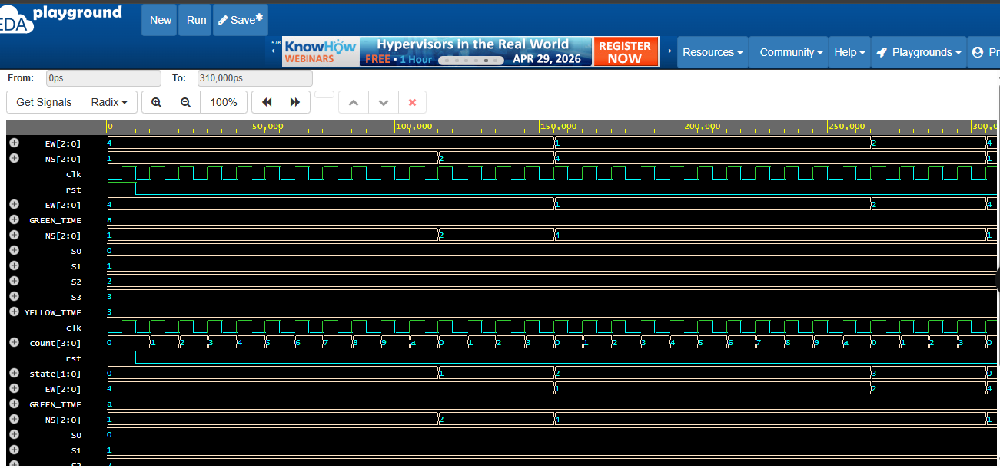

# 🚦 Traffic Light Controller using FSM (Verilog HDL)

This project implements a Traffic Light Controller using a Moore Finite State Machine (FSM) in Verilog HDL. It controls traffic flow at an intersection using timed state transitions.

## 📌 Features
- 4-state FSM (S0–S3)
- NS & EW traffic control
- Counter-based timing
- Moore Machine design

## 🧠 FSM States
- S0: NS Green, EW Red
- S1: NS Yellow, EW Red
- S2: NS Red, EW Green
- S3: NS Red, EW Yellow

## 🛠 Tools Used
- Verilog HDL
- EDA Playground

## 🔗 Simulation Link
https://www.edaplayground.com/x/WTmJ

## 📊 Simulation Output
The waveform verifies correct state transitions:
S0 → S1 → S2 → S3 → repeat

NS and EW signals operate correctly with proper timing.

## 📁 Files
- traffic_light.v
- tb.v
- Project Report (PDF)
